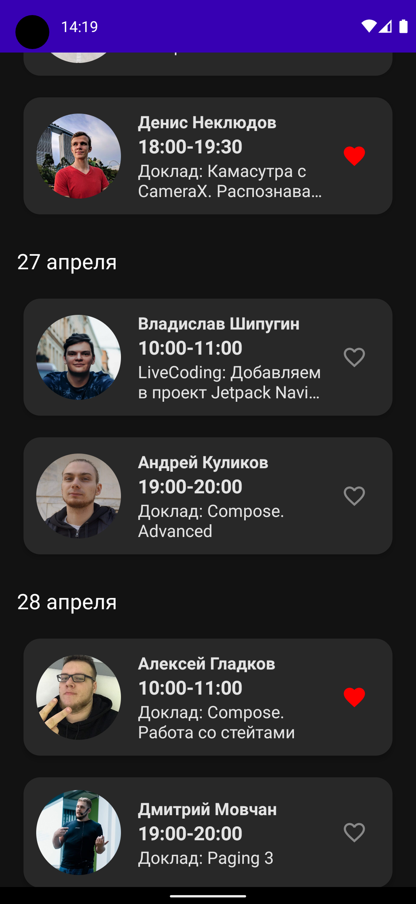

# Podlodka Compose Test

Android приложение со списком сессий с конференции Podlodka Android Crew. Проект создавался, чтобы попробовать Jetpack Compose по [заданию](https://docs.google.com/document/d/1XiNfo4pGc5VT1e-88bU7JB23IxE3QAmVOovgFT7FSwA/edit#heading=h.bmu8ah9f0etu).

## Стек технологий Android приложения

* Jetpack Compose
* Kotlin
* MVVM
* Hilt

## Скриншоты

  
  
  

## Требования:
1. Сессии должны быть сгруппированы по дате.
2. При нажатии на сессию, нужно перейти на экран подробного просмотра сессии.
3. Сессию можно добавить в избранное, нажав на иконку "избранное", при этом она остается в текущем списке и должна быть добавлена в блок избранное. Повторное нажатие на эту иконку должно убрать сессию из избранного. Если в избранном нет ни одной сессии, то этот блок скрывается.
4. Максимум можно добавить только 3 сессии в избранное, иначе нужно показать SnackBar с сообщением: "Не удалось добавить сессию в избранное".
5. Избранные сессии должны переживать изменение конфигурации устройства, но могут очищаться при каждом перезапуске приложения.
6. Приложение должно поддерживать темную и светлую темы

## Дополнительные задания:
1. При нажатии на кнопку "назад" на экране списка сессий, нужно показать диалог с сообщением: "Вы уверены, что хотите выйти из приложения?"  и двумя кнопками: "да" и "отмена". При утвердительном ответе пользователя, необходимо выйти из приложения, иначе закрыть диалог.
2. Реализовать поиск по сессиям в приложении либо по названию сессии, либо по имени докладчика. При этом поиск не влияет на избранные сессии.
3. Загружать список сессий удаленно (ссылка на json). При этом необходимо добавить состояние загрузки данных и состояние ошибки, если произошла ошибка при загрузке данных.

Основные требования все выполнены за исключением показа SnackBar, на его месте показывается Toast. Дополнительные задания в этом проекте не реализованы.
